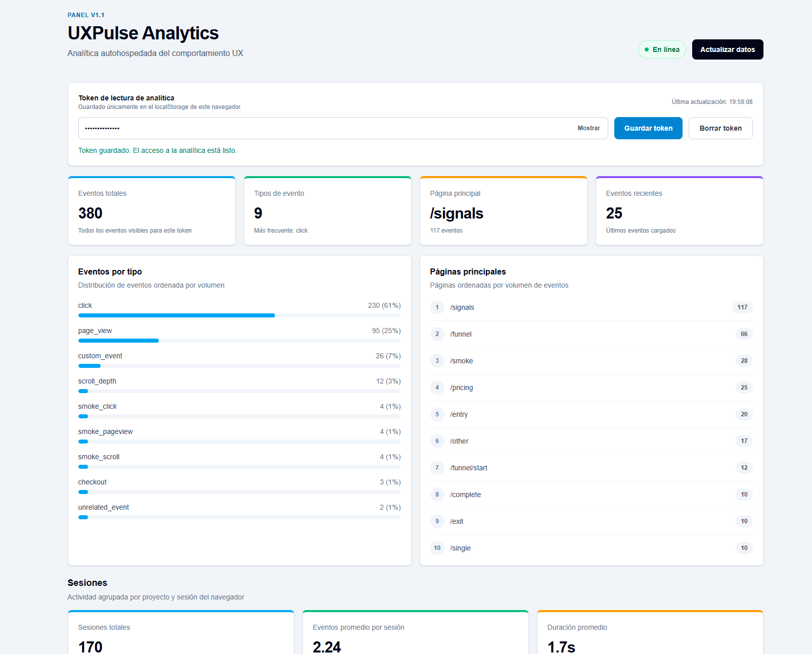
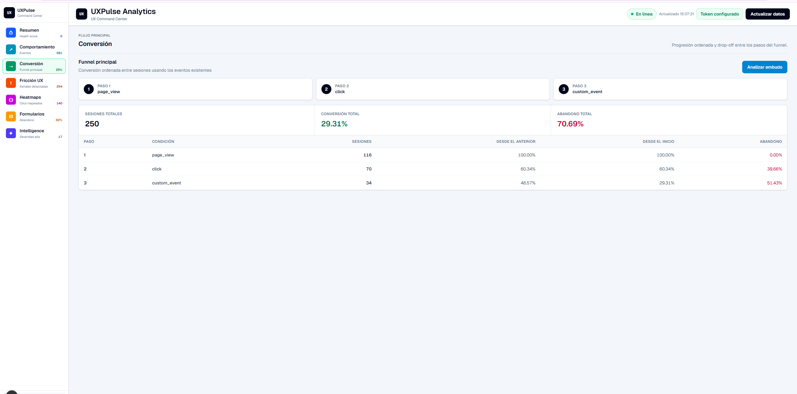
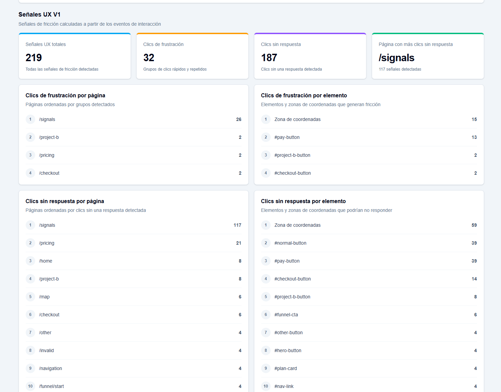
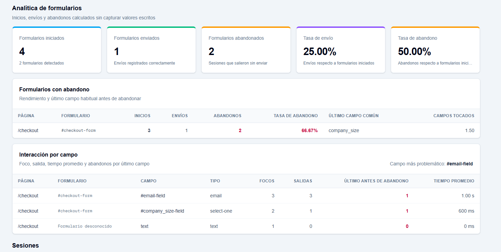
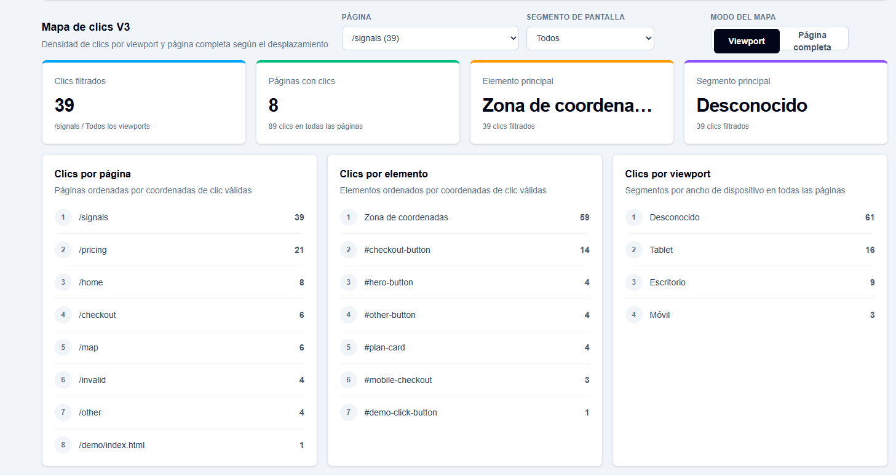
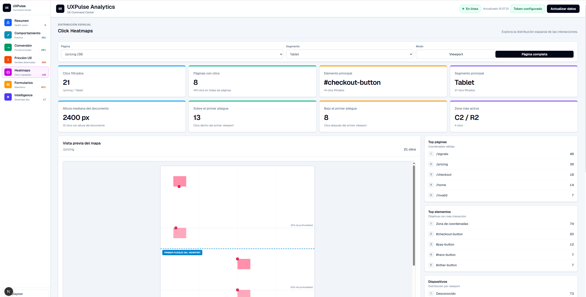
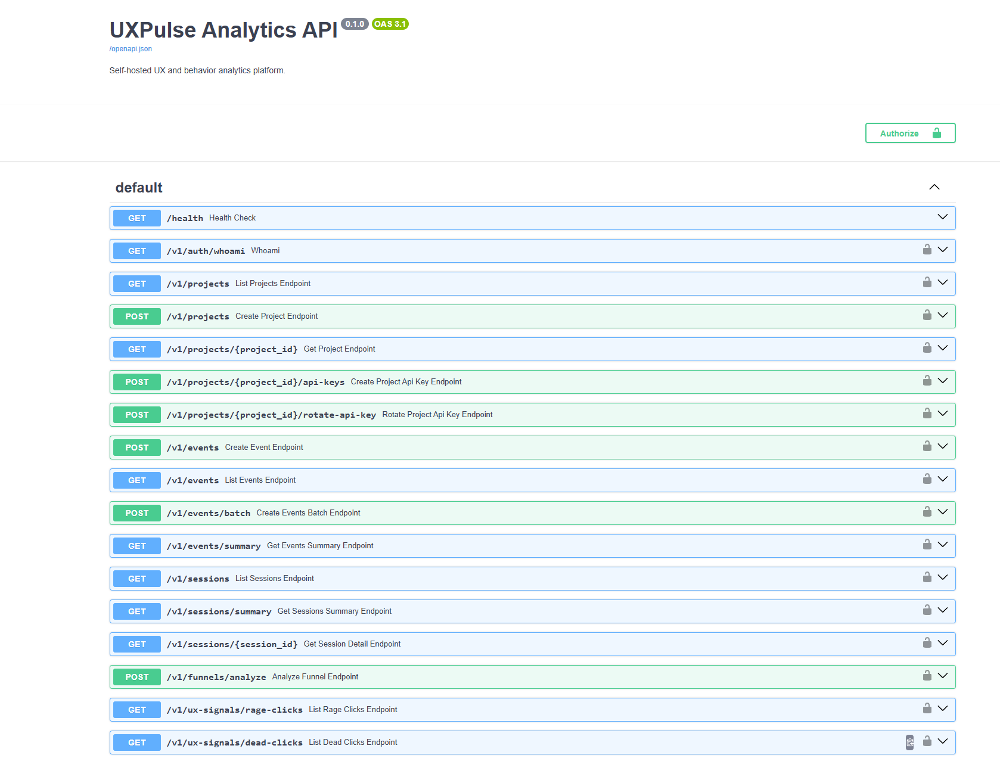

# UXPulse Analytics

Plataforma autohospedada de analítica del comportamiento UX, construida con
FastAPI, PostgreSQL, Next.js y un SDK TypeScript para navegador.

## Características

- Event Tracking API con ingesta individual y por lotes.
- SDK TypeScript para navegador que captura vistas de página, clics,
  profundidad de desplazamiento, eventos personalizados y actividad
  estructural de formularios.
- Dashboard en Next.js con eventos, sesiones, embudos, señales UX y Form
  Analytics.
- Analítica de sesiones y análisis ordenado de embudos.
- Detección de Rage Clicks y Dead Clicks.
- Form Analytics con detección de abandono, métricas de formularios iniciados,
  enviados y abandonados.
- Field-level friction analysis para identificar los campos con mayor
  fricción sin capturar valores escritos.
- Mapas de clics por viewport y mapas de página completa sensibles al
  desplazamiento.
- Segmentación por desktop, tablet, mobile y unknown.
- Zonas de intensidad y distribución de clics por profundidad de
  desplazamiento.
- Permisos separados para API keys de tipo `ingest` y `read`.
- Aislamiento de datos por proyecto.
- Persistencia en PostgreSQL con migraciones Alembic.
- Smoke tests de extremo a extremo para los principales flujos de analítica.

## Arquitectura

- `backend/`: API FastAPI, modelos SQLAlchemy, servicios de analítica y
  migraciones Alembic.
- `frontend/`: dashboard en Next.js para eventos, sesiones, embudos, señales
  UX, formularios y mapas de clics.
- `sdk/`: SDK para navegador que captura vistas de página, clics, profundidad
  de desplazamiento, eventos personalizados y metadata estructural segura de
  formularios.
- `scripts/`: utilidades de base de datos y smoke tests de extremo a extremo.

## Capturas

### Vista general del dashboard


### Analítica de sesiones



### Análisis de embudos



### Señales UX



### Form Analytics



### Mapa de clics por viewport



### Mapa de clics de página completa



### Documentación de la API



## API keys

Las claves de proyecto tienen permisos separados:

- `ingest`: destinada al SDK del navegador. Solo puede enviar eventos.
- `read`: destinada al dashboard o a clientes de analítica confiables del lado
  del servidor. Solo puede consultar la analítica.
- La master key puede administrar proyectos y consultar la analítica de todos
  los proyectos.

Nunca incluyas una clave `read` ni la master key en una aplicación pública del
navegador.

Crea una clave de proyecto con permisos definidos:

```json
{
  "name": "SDK de navegador en producción",
  "key_type": "ingest"
}
```

Usa `"key_type": "read"` para una clave destinada al dashboard.

## Privacidad

La captura de formularios sigue un enfoque privacy-by-design. UXPulse no
recopila valores de formularios, contraseñas, textos escritos, selecciones ni
estados `checked`; solo utiliza metadata estructural segura para la analítica.

## Tiempo de los eventos

Los eventos almacenan dos marcas de tiempo:

- `occurred_at`: cuándo ocurrió el evento en el navegador.
- `created_at`: cuándo el backend guardó el evento.

Las sesiones, los embudos, el orden de eventos recientes y la detección de Rage
Clicks usan `occurred_at`. Durante la migración, las filas antiguas reciben el
valor existente de `created_at`.

## Migraciones de base de datos

Instala las dependencias del backend:

```powershell
backend\venv\Scripts\python.exe -m pip install -r backend\requirements.txt
```

Para una base de datos nueva, aplica todas las migraciones desde la raíz del
repositorio:

```powershell
backend\venv\Scripts\python.exe scripts\create_tables.py
```

Para una base de datos creada previamente con `Base.metadata.create_all`,
adopta la migración base una vez y luego actualiza:

```powershell
backend\venv\Scripts\python.exe -m alembic -c alembic.ini stamp 20260609_0001
backend\venv\Scripts\python.exe -m alembic -c alembic.ini upgrade head
```

No ejecutes `stamp` sobre una base de datos vacía. Las bases nuevas deben
ejecutar directamente `upgrade head`.

Las claves de proyecto existentes se migran a `ingest` porque podrían estar
incluidas en código del navegador. Después de actualizar, crea una nueva clave
`read` para cada dashboard o cliente de analítica confiable.

## Ejecución local

Backend:

```powershell
cd backend
venv\Scripts\python.exe -m uvicorn app.main:app --reload --port 8002
```

Frontend:

```powershell
cd frontend
npm run dev:3003
```

Abre `http://127.0.0.1:3003` y usa la master key o una clave de proyecto
`read`. La demo del SDK debe usar una clave de proyecto `ingest`.

## Smoke tests

Con PostgreSQL y el backend en ejecución:

```powershell
python scripts\smoke_test_projects_auth.py
python scripts\smoke_test_events.py
python scripts\smoke_test_sessions.py
python scripts\smoke_test_funnels.py
python scripts\smoke_test_ux_signals.py
python scripts\smoke_test_heatmaps.py
python scripts\smoke_test_forms.py
```

## Higiene del repositorio

Los entornos virtuales, `node_modules`, bytecode de Python, artefactos de
compilación, archivos locales de entorno y cachés de pruebas están ignorados.
Las dependencias deben reconstruirse desde los manifiestos versionados, en
lugar de subirse a Git.
